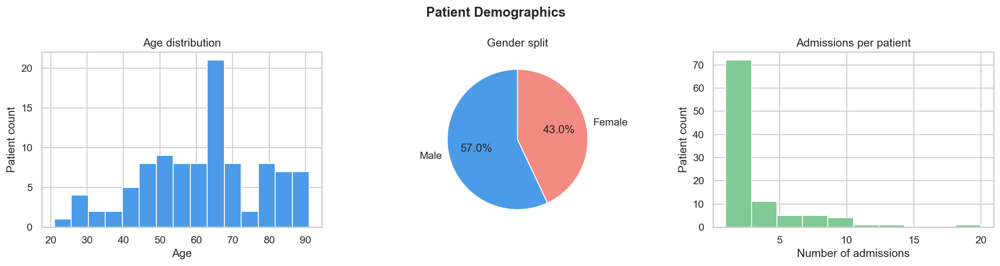
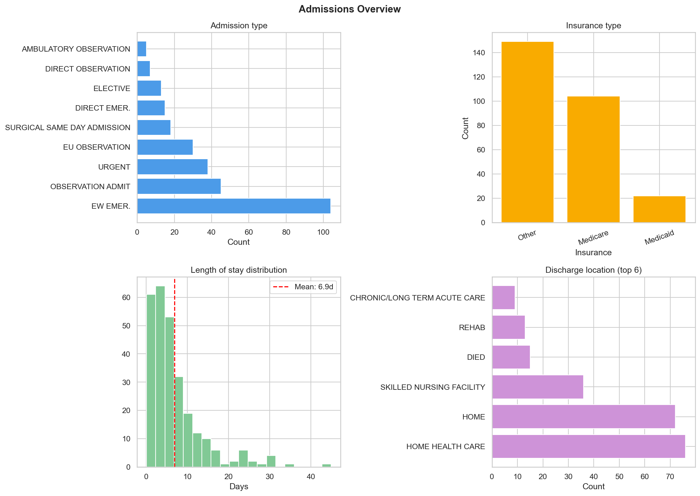
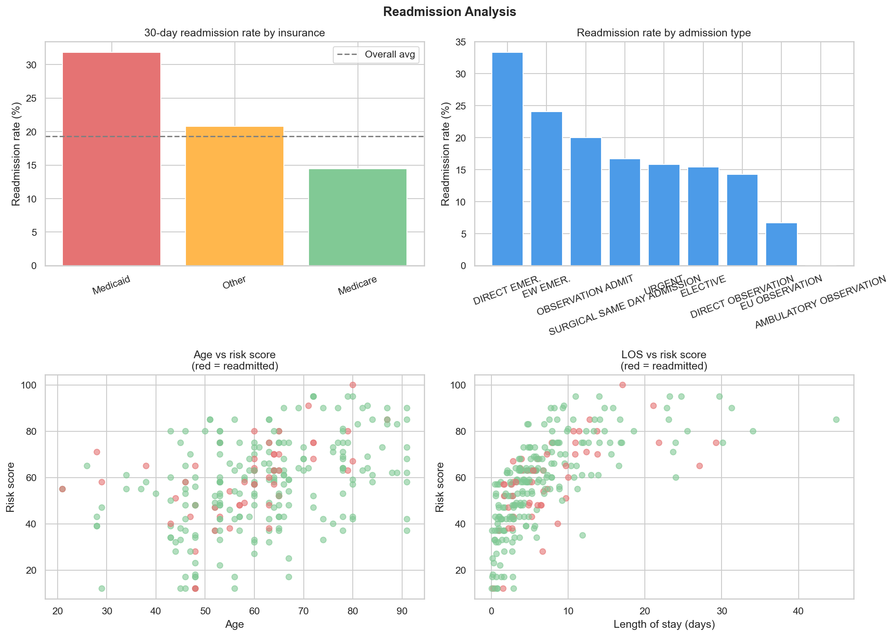
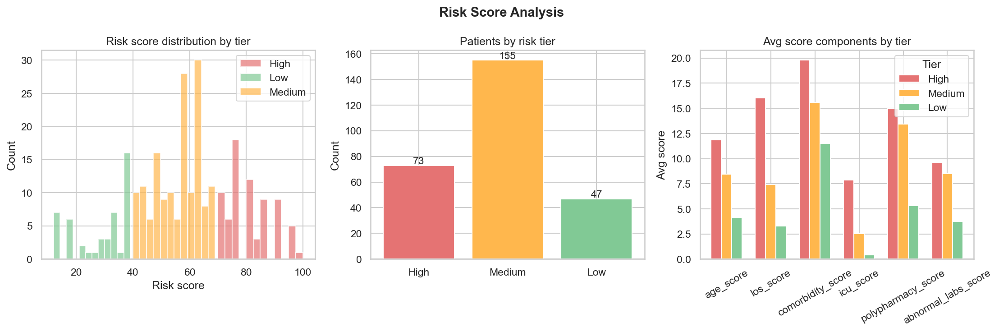
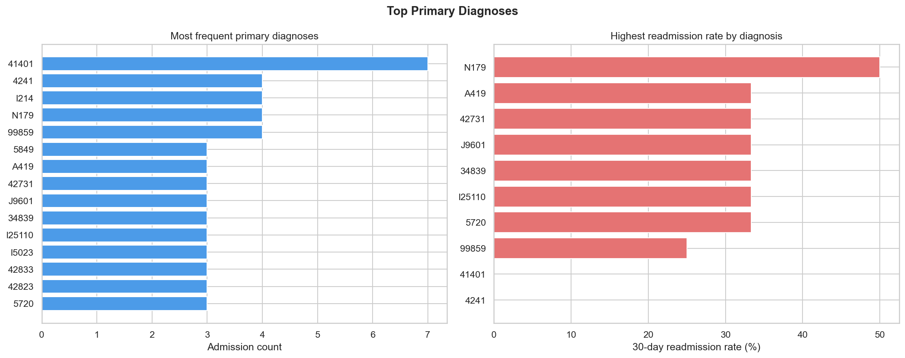

# 🏥 Hospital Readmission Risk Analysis

A end-to-end healthcare analytics project analyzing 30-day hospital readmission risk using real clinical EHR data from **MIMIC-IV** (Beth Israel Deaconess Medical Center, Harvard Teaching Hospital).

🔗 **[Live Tableau Dashboard](https://public.tableau.com/app/profile/shubham.rajiwade/viz/HospitalReadmissionRiskAnalysis-MIMIC-IV/Dashboard1)**

---

## 📌 Problem Statement

Hospital readmissions within 30 days of discharge are a critical quality metric tracked by the Centers for Medicare & Medicaid Services (CMS). Hospitals with high readmission rates face financial penalties under the Hospital Readmissions Reduction Program (HRRP). This project identifies high-risk patients at discharge using clinical features, enabling care teams to prioritize follow-up interventions.

---

## 📊 Key Findings

- **19.3% 30-day readmission rate** — above the 15% national benchmark
- **Medicaid patients readmit at 31.8%** vs 14.4% for Medicare — a clinically validated disparity
- **ICD E11621** (diabetic foot ulcer) has the highest readmission rate at 100%
- **73 high-risk patients** (score ≥ 70) identified for immediate follow-up
- **ICU patients** average 14.1 days LOS vs 6.9 days overall
- Patients aged **60-69** have the highest admission volume, but **Under 40** has the highest readmission rate (26.7%)

---

## 🛠 Tech Stack

| Tool | Purpose |
|---|---|
| MySQL 9.6 | Database design, schema, analytical queries |
| Python 3.13 | Data loading, feature engineering, EDA |
| Tableau Public | Interactive dashboard |
| MIMIC-IV Demo | Real de-identified clinical EHR data |
| pandas | Data manipulation and analysis |
| matplotlib / seaborn | Exploratory data visualizations |
| Git / GitHub | Version control |

---

## 📁 Project Structure

```
hospital-readmission-risk/
├── load_data.py              # Loads MIMIC-IV CSVs into MySQL
├── compute_features.py       # Computes LOS, 30-day flags, risk scores
├── eda.py                    # Exploratory data analysis — 5 charts
├── dashboard_queries.sql     # SQL queries powering Tableau dashboard
├── eda_outputs/              # EDA chart outputs (PNG)
│   ├── 1_demographics.png
│   ├── 2_admissions.png
│   ├── 3_readmissions.png
│   ├── 4_risk_scores.png
│   └── 5_diagnoses.png
└── .gitignore
```

---

## 🗄 Database Schema

8-table MySQL schema built on MIMIC-IV clinical data:

```
patients          → demographics (age, gender)
admissions        → hospital stays, LOS, 30-day readmission flag
diagnoses_icd     → ICD-9/ICD-10 diagnosis codes
procedures_icd    → surgical procedures
labevents         → 107,727 lab test results with abnormal flags
prescriptions     → 18,087 medication records
icustays          → ICU-specific stay data
patient_risk_scores → derived risk scores (0-100) per admission
```

---

## ⚙️ Risk Scoring Model

Each admission is scored 0–100 based on 6 clinical factors:

| Factor | Max Points | Logic |
|---|---|---|
| Age | 20 | ≥80 = 20pts, ≥70 = 15pts, ≥60 = 10pts |
| Length of stay | 20 | ≥14 days = 20pts, ≥7 = 15pts |
| Comorbidities | 20 | ≥15 diagnoses = 20pts, ≥10 = 15pts |
| ICU stay | 15 | ICU LOS ≥7 days = 15pts |
| Polypharmacy | 15 | ≥20 drugs = 15pts, ≥10 = 10pts |
| Abnormal labs | 10 | ≥30% abnormal ratio = 10pts |

**Risk Tiers:** High ≥ 70 · Medium 40–69 · Low < 40

---

## 📈 EDA Charts

### Patient Demographics


### Admissions Overview


### Readmission Analysis


### Risk Score Distribution


### Top Diagnoses


---

## 🚀 How to Run

### Prerequisites
- MySQL 9.6+
- Python 3.x
- MIMIC-IV Demo dataset from [PhysioNet](https://physionet.org/content/mimic-iv-demo/2.2/)

### Setup

```bash
# Clone the repo
git clone https://github.com/shubhamrajiwade29/hospital-readmission-risk.git
cd hospital-readmission-risk

# Install dependencies
pip3 install pandas mysql-connector-python matplotlib seaborn

# Create MySQL database
# Run schema_design.sql in MySQL Workbench

# Update DB credentials in each script
# Replace YOUR_PASSWORD_HERE with your MySQL root password

# Load data
python3 load_data.py

# Compute features and risk scores
python3 compute_features.py

# Run EDA
python3 eda.py
```

---

## 📊 Dataset

**MIMIC-IV Clinical Database Demo v2.2**
- Source: Beth Israel Deaconess Medical Center (Harvard Teaching Hospital)
- 100 de-identified ICU patients
- 275 hospital admissions
- 107,727 lab events
- 18,087 prescription records
- 4,506 ICD diagnosis codes

> Data accessed via [PhysioNet](https://physionet.org/content/mimic-iv-demo/2.2/). All data is fully de-identified. No real patient information is included.

---

## ⚠️ Data Privacy Note

This project uses MIMIC-IV, a de-identified clinical database maintained by MIT Laboratory for Computational Physiology. All protected health information (PHI) has been removed per HIPAA Safe Harbor standards. Data is used strictly for educational and portfolio purposes.

---

## 👤 Author

**Shubham Rajiwade**
- Graduating December 2026 · Northeastern University
- Targeting Data Analyst / BI Analyst / Analytics Engineer roles
- [LinkedIn](https://www.linkedin.com/in/shubham-rajiwade-8106842a7/) · [Tableau Public](https://public.tableau.com/app/profile/shubham.rajiwade/vizzes) · [GitHub](https://github.com/shubhamrajiwade29)

---

## 📝 License

This project is licensed under the MIT License.
